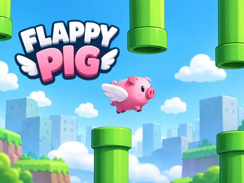
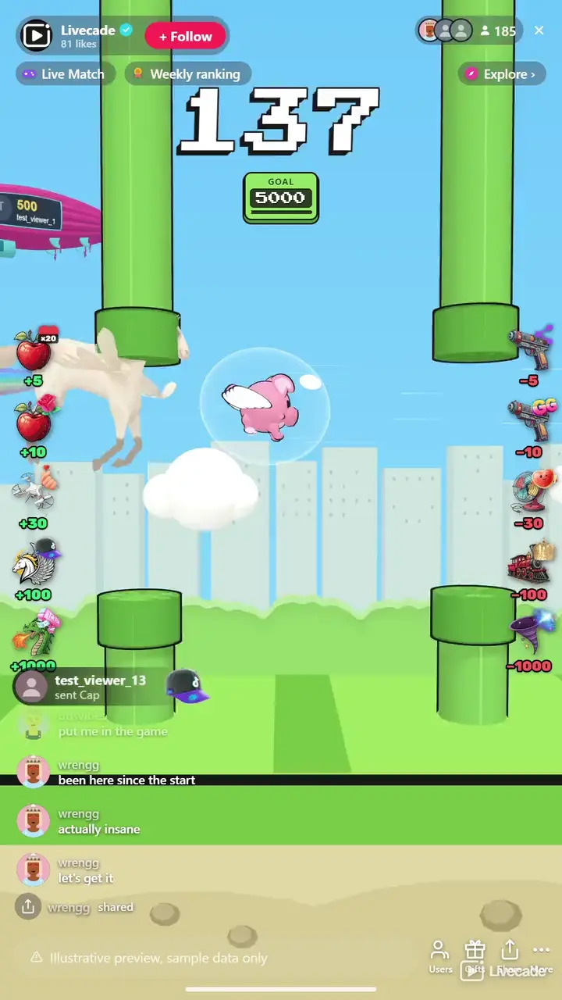

# Flappy Pig 3D - Interactive TikTok Live Game

> One pig, one endless course, and a chat that cannot agree which way it should go.

One flying pig, one endless 3D pipe course, and a chat arguing over how far it gets. Four props carry the pig forward, four drag it back, and every time it reaches your distance goal the stream banks a win.

**[Play Flappy Pig 3D on Livecade](https://livecade.io/games/flappy-3d/?utm_source=github&utm_medium=readme&utm_campaign=flappy-3d)** - runs as a single browser source in OBS, Streamlabs, or TikTok LIVE Studio. Nothing for viewers to install.

## How viewers play

Viewers take part with the actions TikTok already gives them: **likes**, **shares**, **gifts**. Every action below is rebindable, so you decide which interaction drives which effect.

| Action | What it does |
| --- | --- |
| **Apple** | Carries the pig forward by the distance you set |
| **Drone** | Tows the pig forward by the distance you set |
| **Pegasus** | Flies the pig forward by the distance you set |
| **Dragon** | Carries the pig forward, the showiest prop on the forward side |
| **Gun** | Shoots the pig back by the distance you set |
| **Fan** | Blows the pig backwards by the distance you set |
| **Train** | Knocks the pig back by the distance you set |
| **Black hole** | Drags the pig back, the showiest prop on the sabotage side |
| **+Win** | A blimp flies in and drops a gold trophy to the pig, adding wins |
| **-Win** | A giant mallet bonks the pig, coins spill and wins drop |

## How it works

### The pig flies itself

It holds its own line through the pipes with no input from anyone, so there is nothing to learn and no way to play it badly. You can switch to manual and tap to flap yourself if you would rather fly it.

### Distance wins, wins end the game

The score is pipes flown, and every action moves it forward or back by an amount the sender can see before they send it. Reach your distance goal and the stream banks a win; reach your win goal and it is game over.

### Eight props, two directions

Apple, drone, pegasus and dragon carry the pig forward. Gun, fan, train and black hole pull it back. +Win and -Win skip the distance and move the win count itself.

### You set every distance

The distance each prop moves and the trigger it sits on are both yours. Point them at gifts, likes, shares or a chat keyword, so free viewers can move the pig in both directions too if you want them to.

## About the game

Flappy Pig 3D puts a single pig on an endless course of pipes and hands the distance to your audience. Nobody has to play and nobody can lose it for everyone: the pig holds its own line through the pipes, and what your viewers control is the one number on screen, which is how far it has flown. They control it in both directions.

### Four props push, four props pull

The action list is a ladder read twice. An apple, a drone, a pegasus and a dragon carry the pig forward; a gun, a fan, a train and a black hole drag it back. Each side runs from a small nudge to a run-defining swing, and the two sides sit in their own columns on the overlay with their numbers colour-coded, so a viewer can see which half of the room they are joining without reading a word.

### Every distance is yours to set

Nothing in the ladder is fixed. Each prop carries a distance you choose, on whichever gift, like, share or comment trigger you point it at, so the same eight props can be a gentle push-and-pull or a game where one gift undoes an hour. The only rule the game enforces is the shape: four of them add distance and four take it away.

### Race to the win goal

Every time the pig reaches the distance you set, the stream banks a win: a blimp drops a gold trophy into its arms and a fresh flight starts from zero. Two more actions move the count directly. +Win flies the trophy in, and -Win brings a giant mallet down on the pig (it is a piggy bank, after all) so the coins spill and the count drops. Hit your win goal and the game ends on a champion screen with a New Game button.

### The blimp carries the biggest gifter

A blimp crosses the sky every so often with the top gifter of the session on the side of it, their picture and their coin total painted onto the banner. It changes hands the moment somebody outspends them. Before anyone has gifted it carries the Livecade mark instead, so the sky is never blank.

## What it looks like on stream

[Watch Flappy Pig 3D gameplay](https://cdn.livecade.io/games/flappy-3d.mp4)

## What you can configure

- **Interface language** - Twelve languages for the on-screen chrome
- **Flight mode** - Auto, where the pig flies itself, or manual, where you tap to flap
- **Distance to reach** - Each time the pig reaches it, the stream banks a win and a new flight starts
- **Win goal** - Wins needed for the champion screen, or 0 to play without an end

## Languages

English, Spanish, Portuguese, French, German, Italian, Indonesian, Arabic, Turkish, Russian, Hindi, Romanian

## FAQ

<strong>How do viewers interact with Flappy Pig 3D?</strong>

They trigger props that move the pig. Four props carry it forward and four drag it back, and you decide what sets each one off and how far it moves. Point them at gifts, likes, shares or a chat keyword, in any mix.

<strong>Do viewers fly the pig?</strong>

No, and that is deliberate. The pig holds its own line through the pipes, so there is no skill gate and no way for one person to ruin a run. What your audience decides is how far it gets, not how it flies.

<strong>What happens when the pig hits a pipe?</strong>

It tumbles and recovers, and the distance keeps counting from where it was. A knock costs momentum rather than ending a run, so there is no restart for everybody and no dead stretch while a new round sets up.

<strong>Can viewers undo each other?</strong>

Yes, that is the game. Set the two sides to matching distances and the biggest push and the biggest pull cancel exactly; weight one side heavier and you decide whether the room is fighting uphill or down. The number on screen is whatever chat has argued its way to.

<strong>How do wins work?</strong>

Reaching your distance goal is one win, and +Win or -Win sends move the count directly. It can even go below zero. Once the wins reach your win goal the game shows a champion screen, and New Game starts the next one. Gifts sent while that screen is up still count toward it.

<strong>What is the blimp?</strong>

It carries the biggest gifter of the session, with their picture and coin total on the banner, and it changes hands as soon as somebody outspends them. Before anyone has gifted it carries the Livecade mark.

<strong>Can I fly it myself?</strong>

Yes. Switch the flight mode to manual and you tap to flap, with your viewers still pushing and pulling the distance around you. On auto the pig flies itself and never needs you at all.

<strong>How do I add Flappy Pig 3D to my TikTok Live?</strong>

Add one browser source URL to OBS or your streaming software and go live. There is no plugin to install and nothing for your viewers to download.

## Setup

1. [Create a Livecade account](https://app.livecade.io/register?utm_source=github&utm_medium=cta&utm_campaign=flappy-3d)
2. Copy your overlay browser source URL
3. Paste it into OBS, Streamlabs, or TikTok LIVE Studio
4. Pick Flappy Pig 3D, set your triggers, and go live

Runs in the browser, so it works on Windows and macOS with nothing to download. [See all TikTok Live games](https://livecade.io/tiktok-live-games/?utm_source=github&utm_medium=readme&utm_campaign=flappy-3d).

---

_This repository documents Flappy Pig 3D, a hosted interactive game by [Livecade](https://livecade.io/?utm_source=github&utm_medium=footer&utm_campaign=flappy-3d). The game runs on Livecade's platform, so there is no source to install here._
